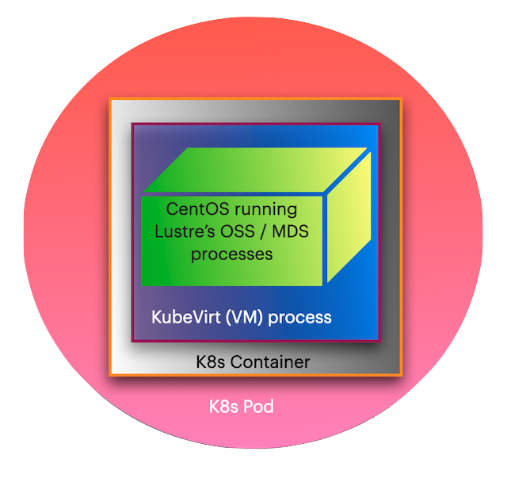
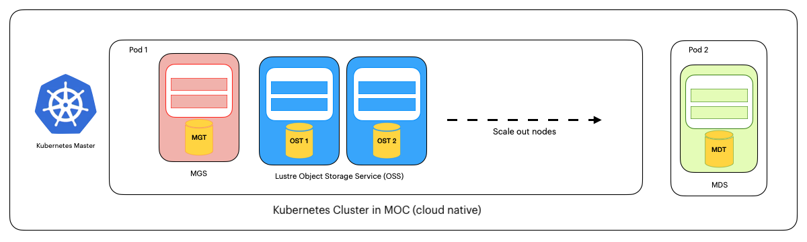
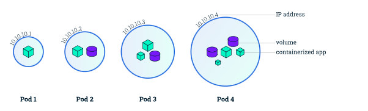
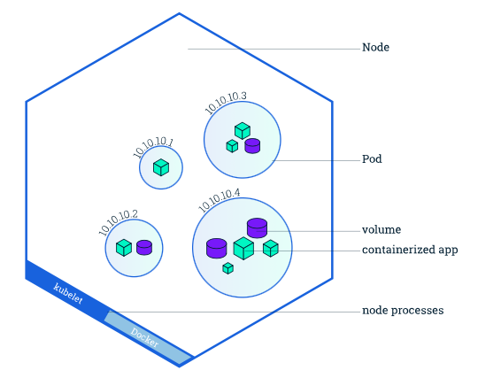
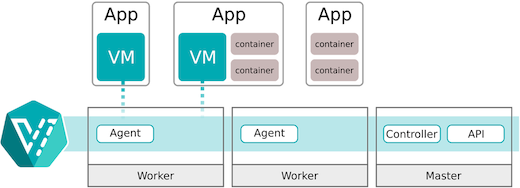

# Advancing-Kubernetes-and-HPC

## 

## The Team

| Mentor             | Email                                           |
| ------------------ | ----------------------------------------------- |
| Dan Lambright      | [dlambrig@gmail.com](mailto:dlambrig@gmail.com) |
| **Team Members**   | **Email**                                       |
| Jiayao Li          | li.jiayao@northeastern.edu                      |
| Vedaj Jeeja Padman | jeejapadman.v@northeastern.edu                  |
| Yumeng Wu          | wu.yume@northeastern.edu                        |
|                    |                                                 |

## Project Description

The project is a continuation of the work done by the students of the Cloud Computing course acrosss both Boston University and Northeastern University over the past few years.

### 1. Vision and Goals

The main vision of the project is to enable Lustre to exist as a well behaved microservice in [Kubernetes](https://kubernetes.io/docs/concepts/overview/what-is-kubernetes/). [Lustre](http://wiki.lustre.org/Main_Page), a distributed parallel filesystem popular in the scientific community, is crucial for dealing with the kind of data associated with the scientific and computational workloads and the the data that these processes in turn, generate.

By realizing Lustre as a Kubernetes microservice, we shall be taking the burden of having to go through innumerable steps of installation and configuration, from its user base. The end goal here is to enable users to simply deploy a container image that will have everything pre-baked, so that Lustre runs smoothly to cater to its user's needs.

The high level goals of the project are:

- Create operators in Golang using the [OperatorSDK:](https://sdk.operatorframework.io) 
  - to automate [pod](https://kubernetes.io/docs/concepts/workloads/pods/) setup, the process of setting up virtual machines and mounting the Lustre components. 
  - to watch out for any failures of  [OSS](https://wiki.lustre.org/Lustre_Object_Storage_Service_(OSS)) component(s), and create a new ones, in case the current one(s) fail(s).
- Wrap the pod setup operator using Helm, to facilitate a single command installation of Lustre, making the underlying configurations transparent to the end user. 

### 2. Users (Personas)

#### User 1: The Biochemist

John works for a research lab where he studies protein folding to discover spike proteins of highly contagious viruses like SARS-CoV-2. The data generated by his experiments easily span a few terabytes at the very least. It is of utmost importance that he should be able to both fetch and write the results of his experiment continuously with very low latency. 

He has a doctorate in Biochemistry and is an expert in Genomics.  Although he has working knowledge of computers and does know a little bit of coding,  it is all limited to his research area. Hence, he is unfamiliar with what goes on in the background when someone says one of the storage pods crashed.    He access a research cloud facility to host his research work, but has to rely extensively on help from the tech support team, every time he needs additional storage space, or go through a long list of commands that look like gibberish to him. 

#### User 2: The Media Editor

Jane is a video editing expert working for a large news corporation where she has to edit hundreds of hours of video footage, performing tasks such as enhancing the quality of the feed to more complex ones such as adding graphics and overlaying other interactive content for the news website. Often the video source is live footage and everything is done on-the-fly. The issue she faces most of the time is that she will run out of storage space while she is on a task and then she will have to wait for someone from the technical team to take care of the issue. She did try taking things into her own hands but the number of steps involved were too many, for her to remember and perform, if she has to scale up storage.  

#### User 3: Enterprise Data Warehouse Guy

Nick is highly skilled with Kubernetes and Lustre. He works in the data warehouse of an e-commerce company with hundreds of thousands of users. The problem he faces is that everytime he either has to scale up or scale down storage, or replace one failed storgae instance with another, he has to run a lot of scripts and wait and check every now and then. Sometimes since binaries are fetched from different servers maintained by various providers, there will be a compatibility issue. Then he will manually have to tweak some parameters and re-run everything again. He feels that this is valuable time he could have spent monitoring for other problems across the data warehouse.

Except for Nick, both the other types of users should never actually be bothered with the pod setup or any related operations. This is more of a IT/DevOps task. Our target audience is mainly these people but with the Helm wrapping, we have simplified the installation and maintenance of Lustre pods, an easier task for all the three user types mentioned here. Other audience who could benefit from our solution include but are not limited to meterologists, financial data analysts, oil and gas discoverers, high energy physicists.

### 3. Scope and Features of The Project:

Continue implementing features developed by last year's student group

- Set up Kubernetes on MOC instances.
- Run command-line scripts to automate running Lustre on Kubernetes.

Write Golang scripts to create "operators" that monitor the cluster and automate the maintenance of Luster within Kubernetes

- Pod Setup : to set up the VMs, and mount the Lustre components.
- Pod Recovery : Create a new Lustre instance by monitoring for any failure of OSS components.

Create a simpified method to set up Lustre in Kubernetes by wrapping the Pod Setup Operator using [Helm.](https://helm.sh)

### 4. Solution Concept & Glossary of Terms:

##### Global Architectural Structure

The entire system consists of two major components viz. Kubernetes and Lustre. In fact, Lustre is nested inside Kubernetes. The figure below gives a conceptual overview of the system. 

The way we had envisioned our system, lets us add or remove new pods automatically using the autoscale operator built by our [predecessor teams](https://github.com/BU-CLOUD-F20/Realizing_Microservices_HPC). In addition to this, we have introduced operators that facilitate pod recovery and pod setup. The pod setup operation is now just a single command, as we wrapped all the steps involved in that operator using Helm. 

The figure below shows the structure of our project setup. 

##### Kubernetes Related Terms

###### [Kubernetes](https://kubernetes.io/docs/concepts/overview/what-is-kubernetes/)

Kubernetes is a portable, extensible, open-source platform for managing containerized workloads and services, that facilitates both declarative configuration and automation. It has a large, rapidly growing ecosystem. Kubernetes services, support, and tools are widely available.

###### [Kubernetes Container](https://kubernetes.io/docs/concepts/containers/)

A Kubernetes container is a run is a bundling of (an) application(s) with all its dependecies included and preconfigured. The standardization from having dependencies included means that you get the same behavior wherever you run it.

Containers decouple applications from underlying host infrastructure. This makes deployment easier in different cloud or OS environments.

###### [Kubernetes Pods](https://kubernetes.io/docs/concepts/workloads/pods/)

*Pods* are the smallest deployable units of computing that you can create and manage in Kubernetes.

A *Pod* (as in a pod of whales or pea pod) is a group of one or more containers, with shared storage and network resources, and a specification for how to run the containers. A Pod's contents are always co-located and co-scheduled, and run in a shared context. A Pod models an application-specific "logical host": it contains one or more application containers which are relatively tightly coupled. In non-cloud contexts, applications executed on the same physical or virtual machine are analogous to cloud applications executed on the same logical host.

###### [Kubernetes Node](https://kubernetes.io/docs/tutorials/kubernetes-basics/explore/explore-intro/)

A Pod always runs on a Node. A Node is a worker machine in Kubernetes and may be either a virtual or a physical machine, depending on the cluster. Each Node is managed by the Master. A Node can have multiple pods, and the Kubernetes master automatically handles scheduling the pods across the Nodes in the cluster. The Master's automatic scheduling takes into account the available resources on each Node.

###### [Kubernetes Master](https://kubernetes.io/docs/tutorials/kubernetes-basics/explore/explore-intro/)

A Master Node is a node which controls and manages a set of Worker Nodes (workloads runtime) and resembles a cluster in Kubernetes.

###### [KubeVirt](https://www.openshift.com/learn/topics/virtualization/)

KubeVirt is the open source project that makes it possible to run virtual machines in a Kubernetes-managed container platform. KubeVirt delivers container-native virtualization by leveraging KVM, the Linux Kernel hypervisor, within a Kubernetes container. KubeVirt provides services like those associated with traditional virtualization platforms, providing the best of both mature virtualization management technology and Kubernetes container orchestration.

##### Lustre Related Terms

###### [Lustre](https://wiki.lustre.org/Main_Page)

_lowres_v1.png)

Lustre is an open-source, distributed parallel file system software platform designed for scalability, high-performance, and high-availability. Lustre is purpose-built to provide a coherent, global POSIX-compliant namespace for very large scale computer infrastructure, including the world's largest supercomputer platforms. It can support hundreds of petabytes of data storage and hundreds of gigabytes per second in simultaneous, aggregate throughput. Some of the largest current installations have individual file systems in excess of fifty petabytes of usable capacity, and have reported throughput speeds exceeding one terabyte/sec.

###### [Management Server (MGS)](https://wiki.lustre.org/Lustre_Management_Service_(MGS))

 The MGS is a global resource that can be associated with one or more Lustre file systems. It acts as a global registry for configuration information and service state. It does not participate in file system operations.

###### [Management Target (MGT)](https://wiki.lustre.org/Introduction_to_Lustre_Object_Storage_Devices_(OSDs))

MGT is the management service storage target which is a block device used to store configuration data.

###### [Metadata Servers (MDS)](https://wiki.lustre.org/Lustre_Metadata_Service_(MDS))

The MDS makes metadata stored in one or more MDTs available to Lustre clients. Each MDS manages the names and directories in the Lustre file system(s) and provides network request handling for one or more local MDTs.

###### [Metadata Targets (MDT)](https://wiki.lustre.org/Introduction_to_Lustre_Object_Storage_Devices_(OSDs))

For Lustre software release 2.3 and earlier, each file system has one MDT. The MDT stores metadata (such as filenames, directories, permissions and file layout) on storage attached to an MDS. Each file system has one MDT. An MDT on a shared storage target can be available to multiple MDSs, although only one can access it at a time. If an active MDS fails, a standby MDS can serve the MDT and make it available to clients. This is referred to as MDS failover.

###### [Object Storage Servers (OSS)](https://wiki.lustre.org/Lustre_Object_Storage_Service_(OSS))

 The OSS provides file I/O service and network request handling for one or more local OSTs. Typically, an OSS serves between two and eight OSTs, up to 16 TiB each. A typical configuration is an MDT on a dedicated node, two or more OSTs on each OSS node, and a client on each of a large number of compute nodes.

###### [Object Storage Target (OST)](https://wiki.lustre.org/Lustre_Object_Storage_Service_(OSS))

User file data is stored in one or more objects, each object on a separate OST in a Lustre file system. The number of objects per file is configurable by the user and can be tuned to optimize performance for a given workload.

###### [Lustre Clients](https://wiki.lustre.org/Lustre_Client_Requirements_Guidelines) 

Lustre clients are computational, visualization or desktop nodes that are running Lustre client software, allowing them to mount the Lustre file system.The Lustre client software provides an interface between the Linux virtual file system and the Lustre servers. The client software includes a management client (MGC), a metadata client (MDC), and multiple object storage clients (OSCs), one corresponding to each OST in the file system.

### 5. Acceptance criteria:

The minimum acceptance criteria is to facilitate Lustre to be deployed with ease on MOC instances running Kubernetes.

- Continue previous work, manipulate Lustre components on the MOC.
- Add more GoLanng operators to facilitate Lustre instance setup, and, recovery.
- Provide some kind of automation to remove as many pain points as possible, for the end user.

### 6. Release Planning:

##### 03/05/2021 Demo 1

- Gain exposure to MOC and Kubernetes - Understand how to build and manage VM instances.
- Setup a Kubernetes cluster with one master node and two worker nodes.
- Present the progress made so far.

##### 03/19/2021 Demo 2

- Familiarize ourselves with the OperatorSDK.
- Debug the network issue.
- Mount Lustre components and test the auto scale up/down operator.
- Present the progress made so far.

##### 04/02/2021 Demo 3

- Create a setup-operator to setup Lustre VM, mount filesystem and deploy a Docker image.
- Present the progress made so far.

##### 04/16/2021 Demo 4

- Enable the setup-opeartor to do auto recovery for the OSS pod.
- Wrap the setup-operator using Helm and verify taht the Helm command works as expected.
- Present the progress made so far.

##### 04/26/2021 Final Presentation and Demo

- Update the documentation.
- Present all the things we achived and demostrate the project.