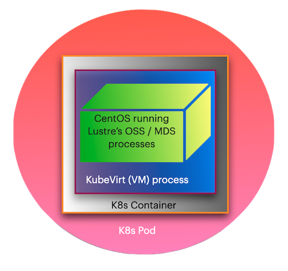

# Advancing-Kubernetes-and-HPC

## MOC Project Proposal

Advancing Kubernetes and High Performance Computing

| Mentor             | Email                                           |
| ------------------ | ----------------------------------------------- |
| Dan Lambright      | [dlambrig@gmail.com](mailto:dlambrig@gmail.com) |
| **Team Members**   | **Email**                                       |
| Jiayao Li          | li.jiayao@northeastern.edu                      |
| Vedaj Jeeja Padman | jeejapadman.v@northeastern.edu                  |
| Yumeng Wu          | wu.yume@northeastern.edu                        |
|                    |                                                 |

## Project Description

The project is a continuation of the work done by the students of the Cloud Computing course acrosss both Boston University and Northeastern University over the past few years.

### 1. Vision and Goals

The main vision of the project is to enable Lustre to exist as a well behaved microservice in [Kubernetes](https://kubernetes.io/docs/concepts/overview/what-is-kubernetes/). [Lustre](http://wiki.lustre.org/Main_Page), a distributed parallel filesystem popular in the scientific community, is crucial for dealing with the kind of data associated with the scientific and computational workloads and the the data that these processes in turn, generate.

By realizing Lustre as a Kubernetes microservice, we shall be taking the burden of having to go through innumerable steps of installation and configuration, from its user base. The end goal here is to enable users to simply deploy a container image that will have everything pre-baked, so that Lustre runs smoothly to cater to its user's needs.

The high level goals of the project are:

- Create operators in Golang using the [OperatorSDK:](https://sdk.operatorframework.io) 
  - to automate [pod](https://kubernetes.io/docs/concepts/workloads/pods/) setup, the process of setting up virtual machines and mounting the Lustre components. 
  - to watch out for any failures of  [OSS](https://wiki.lustre.org/Lustre_Object_Storage_Service_(OSS)) component(s), and create a new ones, in case the current one(s) fail(s).
- Wrap the pod setup operator using Helm, to facilitate a single command installation of Lustre, making the underlying configurations transparent to the end user. 

### 2. Users (Personas)

#### User 1: The Biochemist

John works for a research lab where he studies protein folding to discover spike proteins of highly contagious viruses like SARS-CoV-2. The data generated by his experiments easily span a few terabytes at the very least. It is of utmost importance that he should be able to both fetch and write the results of his experiment continuously with very low latency. 

He has a doctorate in Biochemistry and is an expert in Genomics.  Although he has working knowledge of computers and does know a little bit of coding,  it is all limited to his research area. Hence, he is unfamiliar with what goes on in the background when someone says one of the storage pods crashed.    He access a research cloud facility to host his research work, but has to rely extensively on help from the tech support team, every time he needs additional storage space, or go through a long list of commands that look like gibberish to him. 

#### User 2: The Media Editor

Jane is a video editing expert working for a large news corporation where she has to edit hundreds of hours of video footage, performing tasks such as enhancing the quality of the feed to more complex ones such as adding graphics and overlaying other interactive content for the news website. Often the video source is live footage and everything is done on-the-fly. The issue she faces most of the time is that she will run out of storage space while she is on a task and then she will have to wait for someone from the technical team to take care of the issue. She did try taking things into her own hands but the number of steps involved were too many, for her to remember and perform, if she has to scale up storage.  

#### User 3: Enterprise Data Warehouse Guy

Nick is highly skilled with Kubernetes and Lustre. He works in the data warehouse of an e-commerce company with hundreds of thousands of users. The problem he faces is that everytime he either has to scale up or scale down storage, or replace one failed storgae instance with another, he has to run a lot of scripts and wait and check every now and then. Sometimes since binaries are fetched from different servers maintained by various providers, there will be a compatibility issue. Then he will manually have to tweak some parameters and re-run everything again. He feels that this is valuable time he could have spent monitoring for other problems across the data warehouse.

Except for Nick, both the other types of users should never actually be bothered with the pod setup or any related operations. This is more of a IT/DevOps task. Our target audience is mainly these people but with the Helm wrapping, we have simplified the installation and maintenance of Lustre pods, an easier task for all the three user types mentioned here. Other audience who could benefit from our solution include but are not limited to meterologists, financial data analysts, oil and gas discoverers, high energy physicists.

### 3. Scope and Features of The Project:

Continue implementing features developed by last year's student group

- Set up Kubernetes on MOC instances.
- Run command-line scripts to automate running Lustre on Kubernetes.

Write Golang scripts to create "operators" that monitor the cluster and automate the maintenance of Luster within Kubernetes

- Pod Setup : to set up the VMs, and mount the Lustre components.
- Pod Recovery : Create a new Lustre instance by monitoring for any failure of OSS components.

Create a simpified method to set up Lustre in Kubernetes by wrapping the Pod Setup Operator using [Helm.](https://helm.sh)

### 4. Solution Concept:

##### Global Architectural Structure

The entire system consists of two major components viz. Kubernetes and Lustre,  which contain various other subcomponents. In fact, Lustre is nested inside Kubernetes. The figure below gives a conceptual overview of the system. 

###### **Kubernetes  components:**

- K8s operator definition 

turns distributed storage systems into self-managing, self-scaling, self-healing storage services. It automates the tasks of a storage administrator: deployment, bootstrapping, configuration, provisioning, scaling, upgrading, migration, disaster recovery, monitoring, and resource management.

**Lustre componenets:** 

**Freeflow components:**

>  add figure

### 5. Acceptance criteria:

The minimum acceptance criteria is to ..

- continue previous work, manipulate Lustre components on the MOC
- add more golfing opertor for Kubernetes, including Lustre instance backup, easy configure to install Lustre, dashboard monitoring..
- make Freeflow work inside Kubernetes

### 6. Release Planning:

2/19/2021 **Demo 1**: Setup single instance on MOC

- Follow the instruction of last year's GitHub to create instance on MOC

